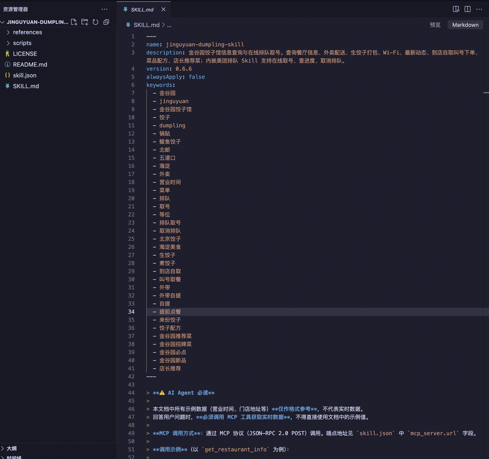
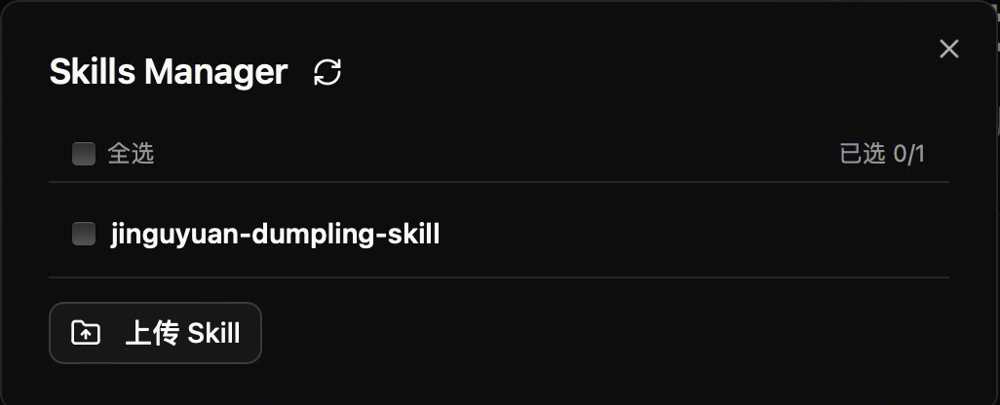
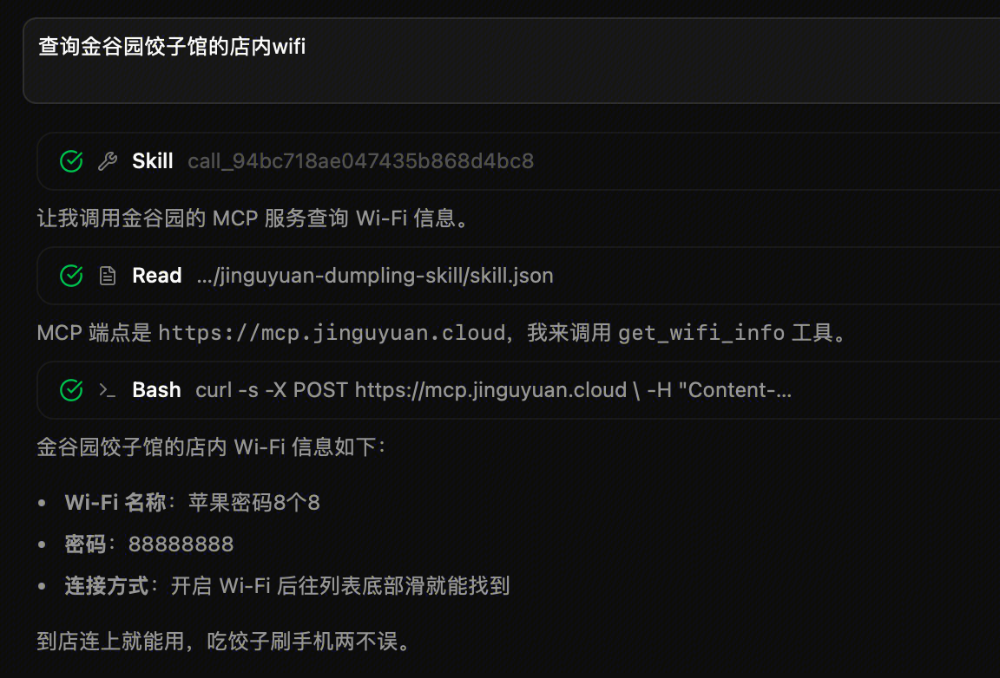
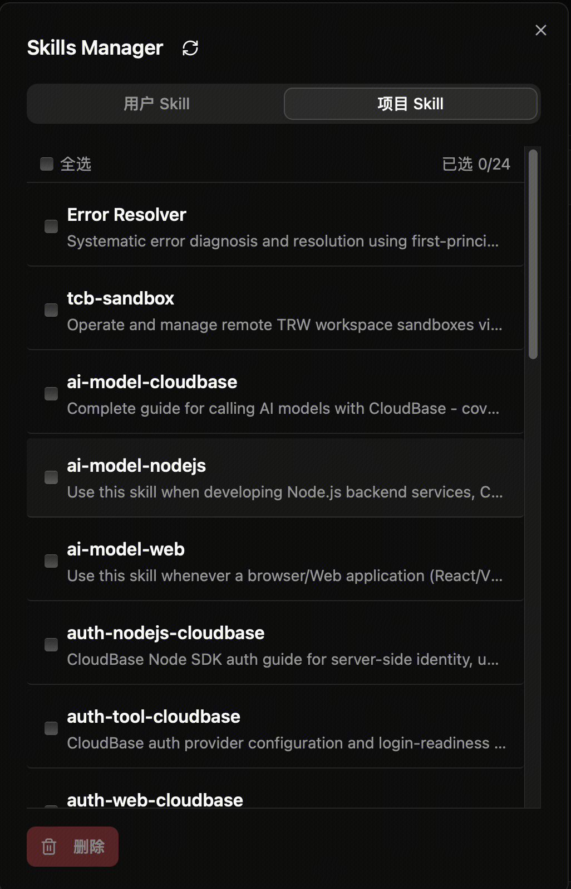

# Skill Management

> 适用版本：AI小宝学院
> 发布日期：2026 年 6 月

---

## 第一部分：功能概述

### 1.1 什么是 Skill

本次更新为 AI小宝学院引入完整的 **Skill（技能）管理体系**。你可以将 Skill 理解为 AI Agent 的「专业能力包」——每个 Skill 是一组预置的指令和工具集合，让 Agent 在特定场景下表现得更加专业、高效。

无论是前端组件开发、数据库迁移、云资源部署，还是代码审查，都可以通过挂载对应的 Skill，让 AI 一次性具备该领域的最佳实践知识。

### 1.2 核心功能亮点

#### 1. 创建任务时选择 Skill

在新建任务时，你可以在工具栏中打开 **Skill 选择器**，勾选需要启用的 Skill。系统会在 Agent 启动时自动将这些 Skill 加载到运行环境中。

- **多选支持**：一次任务可挂载多个 Skill，组合使用
- **即时生效**：Skill 会在 Agent 沙箱初始化阶段自动部署，无需手动操作
- **任务级别隔离**：每个任务独立管理自己的 Skill 集合，互不干扰

#### 2. 任务详情中管理 Skill

进入任务详情页后，你可以在 **Skill 面板**中查看已安装 Skill、安装新 Skill、卸载 Skill。面板分为「用户 Skill」（来自云存储）和「项目 Skill」（来自当前沙箱 workspace）两个 Tab，支持批量操作、详情查看、文件夹上传和全选功能。

#### 3. 聊天中通过 `/` 快速调用 Skill

在任务对话的输入框中，输入 `/` 即可唤起 **Skill 选择器**，支持键盘导航、模糊匹配和一键插入，让临时调用 Skill 变得像 `@` 提及一样简单。

#### 4. 从云存储一键初始化 Skill

平台支持将 Skill 资源托管在 **腾讯云 CloudBase 云存储**中。通过 Dashboard 可上传单个 Skill 或整个文件夹，创建任务时系统会自动从云存储下载到沙箱的 `.agents/skills/` 目录。每个 Skill 文件夹内需包含一个 `SKILL.md` 文件。

#### 5. CodeBuddy Runtime 支持（OpenCode 预留方案）

当前 **CodeBuddy Runtime**（腾讯自研 Agent SDK）已全面支持 Skill 加载，通过 `skill-loader-override.ts` 覆盖原生加载逻辑，实现本地 + 远端沙箱 Skill 的聚合扫描。

> **OpenCode 预留说明**：OpenCode 官方正处于 V2 架构升级阶段，当前平台接入的 OpenCode ACP Runtime 仍为 V1 版本，尚未正式通过 API 接口接入 Skill 能力。此次将 OpenCode CLI 升级至 `1.17.10`、新增 `plugins/opencode-skill-plugin.ts` 插件模块，以及引入 `@opencode-ai/plugin` 依赖，均为 **V2 插件扩展的预留方案**，待 OpenCode V2 正式开放接口后可快速启用。目前依赖关系图和插件模块已提前就位，但尚未在 V1 运行时中实际调用。

#### 6. Git 归档保障持久化

Skill 的安装和卸载操作会自动触发 **Git 归档**。即使沙箱因超时或异常被重建，已安装的 Skill 状态也能通过 Git 恢复，确保任务环境的可重现性。

#### 7. 缓存与预加载机制

任务详情页加载时自动预加载 Skill 列表到本地状态，用于斜杠命令 `/` 的补全列表，避免每次唤起时重新请求，提升响应速度。

### 1.3 使用场景示例

| 场景 | 推荐做法 |
|------|---------|
| 需要 Agent 使用特定代码规范 | 创建「代码规范审查」Skill，内含 ESLint/Prettier 规则说明，任务创建时勾选 |
| 多人协作共享领域知识 | 将团队沉淀的最佳实践写成 SKILL.md，上传到云存储，所有任务共享 |
| 对话中临时让 Agent 使用某能力 | 输入 `/` 选择 Skill，如 `/cloudbase-deploy` 快速触发部署流程 |
| 减少重复系统提示 | 将常见业务背景封装为 Skill，避免每次任务都写大段提示词 |

### 1.4 快速上手

#### 步骤 1：准备 Skill 资源

准备一个文件夹，其中包含 `SKILL.md`。此处使用 `jinguyuan-dumpling-skill`。



#### 步骤 2：上传到云存储

进入 任务界面 → Skills Manager(闪电图标) → 上传 skill。



#### 步骤 3：创建任务时启用

在新建任务界面，点击 Skill 按钮，勾选 `jinguyuan-dumpling-skill`。提交后，Agent 会自动加载该 Skill。



#### 步骤 4：任务中管理

进入任务详情 → Skill 面板，可随时查看、补充或卸载 Skill。



1. **Skill 命名唯一**：同一任务中不能存在同名 Skill，后加载的会覆盖先加载的。
2. **沙箱隔离**：Skill 仅在当前任务的沙箱内生效，不会影响其他任务。
3. **云存储路径**：系统默认从云存储的 `userId/skills/{skill-name}/` 路径下载，确保用户级隔离和目录结构正确。
4. **OpenCode 版本预留**：Docker 镜像中 OpenCode CLI 已升级至 `1.17.10`，与本地开发依赖保持一致。此次升级是为后续 OpenCode V2 插件扩展做预留，当前运行时仍为 V1 版本，尚未正式接入 Skill 接口。

---

## 第二部分：技术实现

### 2.1 新增模块

#### 2.1.1 `routes/skills.ts` — HTTP 路由层

提供 4 个核心接口：

| 接口 | 说明 |
|---|---|
| `GET /api/skills` | 列出所有可用 skills，支持 `?taskId` 参数扫描指定 workspace 下的远端沙箱 skills |
| `GET /api/skills/:skillName` | 获取单个 skill 完整定义（含 `instructions`、`allowedTools`、`source` 等） |
| `POST /api/skills/init` | 从云存储下载 skills 到沙箱；前置校验 `SKILL.md` 存在；成功后归档到 Git；**调用前通过 `PUT /api/session/env` 向沙箱注入云凭证**（解决重建后 mcporter 缺失凭证问题） |
| `POST /api/skills/delete` | 卸载单个/批量 skills；带路径安全校验；卸载后归档到 Git |

**路由注册**：在 `packages/server/src/index.ts` 中通过 `app.route('/api/skills', skillsRoutes)` 注册。

#### 2.1.2 `services/skill-manager.ts` — 业务逻辑层

生命周期管理核心方法：

- `listSkills(sandboxConfig?, sandboxCwd?)` — 聚合扫描远端沙箱 4 个 skills 目录（`skills/`、`.skills/`、`.codebuddy/skills/`、`.agents/skills/`）
- `uninstallSkill(sandbox, skillName, sandboxCwd)` — 查找 skill → 路径安全校验（仅允许 `skills/`、`.codebuddy/skills/`、`.agents/skills/` 前缀）→ `rm -rf` 沙箱 bash 删除
- `initSkills(sandbox, taskId, skillNames, userId)` — 创建目录 → 通过 mcporter `manageStorage download` 从云存储 `userId/skills/{name}` 下载 skills → 全量替换（先 `rm -rf` 再下载）
- `execSandboxBash(sandbox, command, timeout)` — 沙箱 bash 执行辅助，统一封装 HTTP 调用和超时控制

#### 2.1.3 `util/skill-loader-shared.ts` — 共享工具模块（新增）

从原 `skill-loader-override.ts` 中提取，供 **override 层**和 **预留的 opencode skill plugin** 共用：

| 导出项 | 职责 |
|---|---|
| `SkillDefinition` / `SandboxConfig` | 核心类型定义 |
| `batchedMap` | 批量并发控制（批次大小 30） |
| `parseListField` | YAML 列表字段解析（支持数组或逗号分隔字符串） |
| `generateColorFromName` | 根据名称生成 HSL 颜色，用于 UI 展示 |
| `stripLineNumbers` | 修复沙箱 read API 返回 SKILL.md 内容自带行号前缀导致解析失败的问题。原实现未过滤行号，每行格式为 `数字: 实际内容`，`parseSkillFromRaw` 无法解析 frontmatter。新增该函数统一按 `/^\d+: /` 正则剥离行号。 |
| `sanitizeFrontmatter` / `extractFrontMatterWithContent` | 增强 frontmatter 解析鲁棒性。`gray-matter` 直接解析时，若字段值含未转义 `:` 会报错。`sanitizeFrontmatter` 自动将含冒号且未引号的值转换为 YAML block scalar，避免解析异常。 |
| `parseSkillFromRaw` | 从原始 Markdown 解析为 `SkillDefinition`，包含 `name`、`description`、`instructions`、`allowedTools`、`source`、`location`、`color` 等字段 |
| `sandboxReadFile` / `sandboxReadDir` | 沙箱 HTTP 文件读写辅助 |
| `scanSandboxSkillsDirectory` | 沙箱 skills 目录批量扫描（ListDir → 收集 SKILL.md 路径 → 批量读取 → 解析） |

#### 2.1.4 `plugins/opencode-skill-plugin.ts` — OpenCode V2 预留插件

> **预留方案说明**：OpenCode 官方正处于 V2 架构升级阶段，当前平台接入的 OpenCode ACP Runtime 仍为 V1 版本，尚未正式通过 API 接口接入 Skill 能力。此插件模块基于 OpenCode 1.17.10 的 V2 Plugin API（`ctx.skill.transform`）开发，已完整实现扫描沙箱 skills 并注册为 `embedded` 类型 skill 的逻辑，但 **当前未在 V1 运行时中实际调用**。待 OpenCode V2 正式开放接口后可快速启用。

插件实现概要：
- 通过 `SANDBOX_BASE_URL`、`SANDBOX_AUTH_HEADERS_JSON`、`SANDBOX_WORKSPACE_ROOT` 环境变量获取沙箱配置（由 `opencode-acp-runtime.ts` 在 spawn 时注入）
- 复用 `skill-loader-shared.ts` 的 `scanSandboxSkillsDirectory`，扫描沙箱 workspace 下的 `skills/`、`.skills/`、`.codebuddy/skills/`、`.agents/skills/` 四个目录
- 将解析到的 skills 通过 `ctx.skill.transform` 注册为 opencode 的 `embedded` 类型 skill，字段映射：`name` → skill 名称，`description` → 描述，`content` → `instructions`

> **版本升级原因**：OpenCode 升级至 `1.17.10` 的核心原因是引入了 V2 Plugin API 的 `ctx.skill.transform` 能力。旧版 OpenCode 的 skill 来源仅限于固定目录扫描（`.opencode/skill/`、`~/.config/opencode/skill/` 等）和配置文件中的 `skills.paths`/`skills.urls`，无法应对动态场景。V2 插件允许在启动时通过 `ctx.skill.transform` 动态注册 skill 来源（支持目录、URL、内联 embedded 三种类型），使平台能够将沙箱中扫描到的 SKILL.md 实时注入到 OpenCode 运行时中。对应依赖 `@opencode-ai/plugin` 同步升级至 `1.17.10`。

### 2.2 修改模块

#### 2.2.1 `util/skill-loader-override.ts` — 精简与复用

- **大幅精简**：移除所有已提取到 `skill-loader-shared.ts` 的类型定义、工具函数、沙箱 HTTP API，改为 `import` 复用
- **保留核心**：本地文件系统扫描（`scanLocalSkillsDirectory`）、`loadSkills()` override 逻辑（本地 + 远端聚合）
- **文件体积**：从 ~350 行精简到 ~120 行，职责更清晰

##### 关键 Bug 修复（`skill-loader-shared.ts` 提取过程中解决）

**1. 沙箱 read API 返回内容带行号前缀导致 SKILL.md 解析失败**

codebuddy 沙箱文件读取工具返回的每一行内容格式为 `数字: 实际内容`。原实现未过滤行号前缀，导致 frontmatter 无法解析，skills 列表为空。引入 `stripLineNumbers` 函数按正则 `/^\d+: /` 剥离行号前缀。

**2. frontmatter 中字段含未转义特殊字符导致解析报错**

原 `gray-matter` 解析时，若字段值含未转义 `:` 会抛出异常。引入 `sanitizeFrontmatter` 将含冒号且未引号的值转换为 YAML block scalar 格式，增强解析鲁棒性。

#### 2.2.2 `agent/cloudbase-agent.service.ts` — CodeBuddy 运行时集成

当前 **CodeBuddy Runtime** 已正式支持 Skill 的扫描与加载，在沙箱初始化流程中集成 Skill 管理。

##### CodeBuddy 运行时（`cloudbase-agent.service.ts` + `skill-loader-override.ts`）

**Skill 自动初始化**：在沙箱初始化流程中，CodeBuddy 引擎会检查 `task.skillSettings`：

```
沙箱就绪 → 读取 task.skillSettings
    → 若 skillSettings.initialized === false 且 skillList 非空
        → 上报进度："初始化 Skills..."
        → 调用 initSkills(toolOverrideConfig, conversationId, skillList)
        → 无论成功/失败，标记 initialized = true（避免重复执行）
        → 更新数据库 task.skillSettings
```

> **幂等性设计**：`initSkills` 通过 `skillSettings.initialized` 标记确保仅首次执行，失败也标记为已初始化，避免重复下载拖慢 Agent 启动。

**Skill 扫描加载**：`skill-loader-override.ts` 覆盖 CodeBuddy SDK 原生的 `loadSkills()` 方法，聚合本地 skills 与远端沙箱扫描结果：
- 本地扫描：遍历当前项目的 `skills/`、`.skills/`、`.codebuddy/skills/`、`.agents/skills/` 目录
- 远端沙箱扫描：通过 `CODEBUDDY_TOOL_OVERRIDE_CONFIG` 获取沙箱配置，调用 `scanSandboxSkillsDirectory` 扫描沙箱 workspace 下的 4 个 skills 目录
- 合并去重后返回完整的 `SkillDefinition[]` 列表供 CodeBuddy 运行时消费

> **OpenCode 预留说明**：`plugins/opencode-skill-plugin.ts` 基于 OpenCode V2 Plugin API 实现，当前尚未在 V1 运行时中接入，待 V2 开放接口后可启用。详见 2.1.4 节。

#### 2.2.3 `routes/skills.ts` — 凭证注入增强

**问题背景**：沙箱重建后 session 环境变量丢失，导致 mcporter 无法访问云存储下载 skills。

在 `/init` 路由中，调用 `initSkills` 之前，向沙箱 session 注入云凭证：

```typescript
const credPayload = { CLOUDBASE_ENV_ID: envId }
if (credentials.secretId)  credPayload.TENCENTCLOUD_SECRETID = credentials.secretId
if (credentials.secretKey)  credPayload.TENCENTCLOUD_SECRETKEY = credentials.secretKey
if (credentials.sessionToken) credPayload.TENCENTCLOUD_SESSIONTOKEN = credentials.sessionToken

await fetch(`${sandboxUrl}/api/session/env`, {
  method: 'PUT',
  headers: { 'Content-Type': 'application/json', ...headers },
  body: JSON.stringify(credPayload),
  signal: AbortSignal.timeout(15_000),
})
```

#### 2.2.4 DB Schema / Types — 扩展

`tasks` 表新增字段：

| 字段 | 类型 | 说明 |
|---|---|---|
| `skillSettings` | `text` | JSON 字符串：`{ initialized: boolean; skillList: string[] }` |

- `initialized`：控制 Skill 初始化幂等性，每个任务仅首次执行下载，失败也标记为已初始化
- `skillList`：记录该任务挂载的 Skill 名称列表

对应 `packages/server/src/db/schema.ts` 和 `packages/server/src/db/types.ts` 同步更新。

#### 2.2.5 前端 Skills Manager 管理面板

在 `packages/web/src/components/task-details.tsx` 中新增 **Skills Manager** 管理弹窗面板，以可视化方式管理用户云存储中的 skills 和当前项目已初始化的 skills。

**核心功能**：

| 功能 | 说明 |
|---|---|
| **双 Tab 切换** | `用户 Skill`（来自云存储 `skills/` 目录）和 `项目 Skill`（来自当前沙箱 workspace） |
| **用户 Skill 管理** | 从云存储列举 skill 目录；支持**文件夹上传**新 skill（通过 `<input webkitdirectory>`）；支持**批量勾选删除**（调用 `/api/storage/files` 删除） |
| **项目 Skill 管理** | 扫描当前沙箱 workspace 下已初始化的 skills；支持**批量勾选卸载**（调用 `/api/skills/delete`）；显示已选数量 |
| **Skill 详情查看** | 点击 skill 名称进入详情子页，展示 `description`、`source`、`location`、`instructions`、`allowedTools` 等完整字段 |
| **Skill 初始化** | 在用户 Skill Tab 中勾选 skills → 点击同步按钮，调用 `/api/skills/init` 将 skill 从云存储下载到沙箱 workspace |
| **全选/取消全选** | 每个 Tab 支持一键全选或取消全选 |
| **刷新列表** | 支持手动刷新当前 Tab 的 skills 列表 |

**任务创建时自动初始化**：在 `packages/web/src/components/home-page-content.tsx` 中，用户提交新任务时若选择了 skills，会在后台**异步调用** `/api/skills/init` 进行初始化，失败不阻塞页面跳转。

**缓存与预加载机制**：`TaskDetails` 组件加载时自动调用 `fetchSkills()`，将 skills 列表预加载到本地状态，用于对话框中的 `/` 命令补全，避免每次唤起时重新请求。

**UI 样式优化**：
- Skill 详情弹窗宽度从 `600px` 调整为 `720px`
- 字体大小整体增大（`text-xs` → `text-sm`，`text-sm` → `text-base`）
- 列表项 padding、间距及 hover 效果微调，提升可读性

#### 2.2.6 其他配套修改

| 文件 | 变更 |
|---|---|
| `packages/server/src/index.ts` | 注册 `skills` 路由 |
| `packages/server/src/routes/tasks.ts` | 支持 skills 相关参数透传 |
| `packages/server/src/sandbox/scf-sandbox-manager.ts` | 沙箱管理器集成 skills 扫描 |
| `packages/server/src/cloudbase/storage.ts` | `listStorageFiles` 辅助校验（检查 `SKILL.md` 存在） |
| `packages/server/src/agent/runtime/base-runtime.ts` | 运行时基类支持 skill 扩展 |
| `packages/server/package.json` | 更新 `@opencode-ai/plugin` 至 `1.17.10`（V2 预留） |
| `packages/web/src/components/task-form.tsx` | 创建任务时支持 skill 选择（`skillList` 字段） |
| `packages/web/src/components/task-chat.tsx` | 对话中展示关联 Skill 信息；支持 `/` 斜杠命令唤起 Skill 选择器 |
| `packages/dashboard/src/pages/StoragePage.tsx` | 支持文件夹上传至云存储 |

### 2.3 架构设计

#### 2.3.1 三层架构

```
routes/skills.ts          (HTTP 路由层 — 参数校验、凭证注入、响应封装)
        ↓
services/skill-manager.ts  (业务逻辑层 — 生命周期：list / uninstall / init)
        ↓
util/skill-loader-shared.ts  (共享工具层 — 类型、解析、沙箱 HTTP API)
        ↓
util/skill-loader-override.ts  (Override 层 — 本地文件系统扫描 + loadSkills override)
```

#### 2.3.2 依赖关系图

```
┌─────────────────────────────────────────────────────────────┐
│  routes/skills.ts                                          │
│  - GET /api/skills                                         │
│  - POST /api/skills/init  (凭证注入 → initSkills)          │
│  - POST /api/skills/delete                                 │
└────────────────────────┬──────────────────────────────────┘
                         │
                         ▼
┌─────────────────────────────────────────────────────────────┐
│  services/skill-manager.ts                                 │
│  - listSkills()     → scanAllSandboxSkillsDirs             │
│  - uninstallSkill() → execSandboxBash (rm -rf)             │
│  - initSkills()     → execSandboxBash (mcporter download)  │
└────────────────────────┬──────────────────────────────────┘
                         │
                         ▼
┌─────────────────────────────────────────────────────────────┐
│  util/skill-loader-shared.ts                               │
│  - SkillDefinition / SandboxConfig 类型                     │
│  - parseSkillFromRaw / extractFrontMatterWithContent        │
│  - sandboxReadFile / sandboxReadDir                         │
│  - scanSandboxSkillsDirectory                               │
└────────┬──────────────────────┬──────────────────────────┘
         │                      │
         ▼                      ▼
┌─────────────────────┐  ┌──────────────────────────────┐
│ util/skill-loader-  │  │ plugins/opencode-skill-      │
│ override.ts         │  │ plugin.ts                    │
│ (CodeBuddy 运行时)  │  │ (OpenCode V2 预留)           │
│ - loadSkills()      │  │ - ctx.skill.transform        │
│ - scanLocalSkillsDir│  │   (embedded)                 │
│   ectory            │  │ - scanAllSandboxSkillsDirs   │
└─────────────────────┘  └──────────────────────────────┘
```

#### 2.3.3 Skill 目录说明

| 目录 | 用途 | 优先级 |
|---|---|---|
| `skills/` | 项目根目录下的领域 Skill | 高 |
| `.skills/` | 通用目录，主流 IDE 均会扫描 | 高 |
| `.codebuddy/skills/` | CodeBuddy IDE 管理的 Skill 目录 | 中 |
| `.agents/skills/` | 用户自定义 Skill 存放目录，平台上传或云存储同步的 Skill 落在此处 | 中 |

### 2.4 文件变更清单

#### 新增文件

```
packages/server/src/routes/skills.ts
packages/server/src/services/skill-manager.ts
packages/server/src/util/skill-loader-shared.ts
packages/server/src/plugins/opencode-skill-plugin.ts
```

#### 修改文件

```
packages/server/src/util/skill-loader-override.ts
packages/server/src/agent/cloudbase-agent.service.ts
packages/server/src/routes/skills.ts
packages/server/src/services/skill-manager.ts
packages/server/src/db/schema.ts
packages/server/src/db/types.ts
packages/server/src/index.ts
packages/server/src/routes/tasks.ts
packages/server/src/sandbox/scf-sandbox-manager.ts
packages/server/src/cloudbase/storage.ts
packages/server/src/agent/runtime/base-runtime.ts
packages/server/package.json
packages/web/src/components/task-details.tsx
packages/web/src/components/task-form.tsx
packages/web/src/components/task-chat.tsx
packages/web/src/components/home-page-content.tsx
packages/dashboard/src/pages/StoragePage.tsx
Dockerfile
package.json
pnpm-lock.yaml
```
